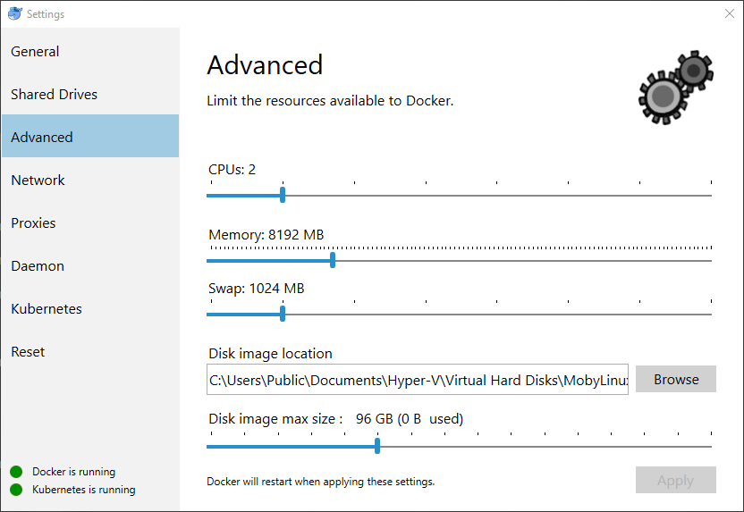
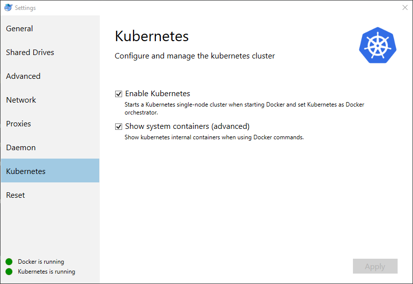
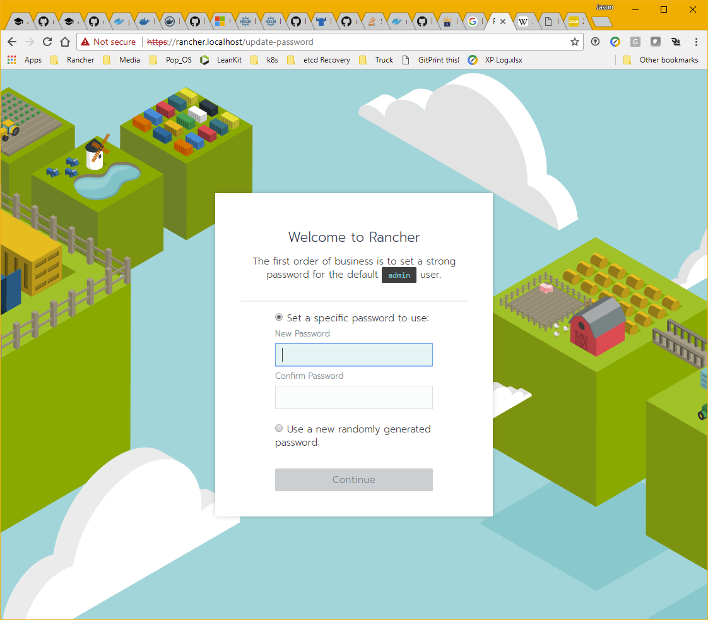

# rancher-for-home
Deploying Rancher 2.0 on Docker-for-desktop k8s style

Don't have access to Cloud infrastructure, but still want to try Rancher 2.0? Want to use Rancher for local development just like you do in production? No problem, you can install it on your desktop.

The examples in this guide were done on Windows, but if you're using a Mac the tool usage should be the same. Some of your paths to binaries and directories may need to be adjusted.

## Prerequisites 

For this guide you will need to have a couple of CLI tools installed for your platform:

* [`kubectl`](https://kubernetes.io/docs/tasks/tools/install-kubectl/) - Kubernetes CLI tool.
* [`helm`](https://docs.helm.sh/using_helm/#installing-helm) - Kubernetes manifest catalog tool.

Clone this git repo: https://github.com/jgreat/helm-rancher-server

## docker-for-desktop

The Edge install of Docker CE for Windows/Mac includes a basic Kubernetes engine. We can leverage it to install a local Rancher Server. Download and install from the Docker Store.

* [Windows](https://store.docker.com/editions/community/docker-ce-desktop-windows)
* [Mac](https://store.docker.com/editions/community/docker-ce-desktop-mac)

### Docker Configuration

Sign into Docker then right click on the Docker icon in your System Tray and select `Settings`

### Advanced Settings

In the `Advanced` section increase `Memory` to at least `4096 MB`. You may want to increase the number of `CPUs` assigned and the `Disk image max size` while you're at it.



### Enable Kubernetes

In the `Kubernetes` section, check the box to enable the Kubernetes API. Docker-for-Windows will automatically create `~\.kube\config` file for access to your new local "cluster".



### Testing Your Cluster

Open terminal and test it out. Run a `kubectl get nodes` command. `kubectl` should return a node named `docker-for-desktop`.

```
> kubectl get nodes

NAME                 STATUS    ROLES     AGE       VERSION
docker-for-desktop   Ready     master    6d        v1.9.6
```

## Preparing Kubernetes

`docker-for-desktop` doesn't come with an `ingress controller` installed.  To add one we could apply some manifests with `kubectl`, but rather than reinventing the wheel, I want leverage kubernetes community. `helm` is the catalog tool of choice for kubernetes.

### Initialize Helm on your Cluster

`helm` installs the `tiller` service on your cluster to manage catalog deployments. Since `docker-for-desktop` has RBAC enabled by default. We need to create a `serviceaccount` and `clusterrolebinding` with `cluster-admin` role so `tiller` can deploy to our cluster for us.

```
kubectl -n kube-system create serviceaccount tiller

kubectl create clusterrolebinding tiller --clusterrole cluster-admin --serviceaccount=kube-system:tiller

helm init --service-account tiller
```

> NOTE: This `tiller` install has full cluster access, and may not be suitable for a production environment. Check out the [helm docs](https://docs.helm.sh/using_helm/#role-based-access-control) for restricting `tiller` access to suit your security requirements.

### Add an Ingress Controller

We're going to install the `nginx-ingress` ingress controller on our local cluster. The default options for the "rancher" `helm` catalog is to use SSL Passthrough.  This will need to be configured with the `--controller.extraArgs.enable-ssl-passthrough=""` option when you launch the catalog.

```
helm install stable/nginx-ingress --name ingress-nginx --namespace ingress-nginx --set controller.extraArgs.enable-ssl-passthrough=""
```

### Setting `hosts` file

By default the Rancher server will listen on `rancher.localhost`. To access it we will need to set a `hosts` file entry so our browser can resolve the name.

* Windows - `c:\windows\system32\drivers\etc\hosts`
* Mac - `/etc/hosts`

Add this entry to the appropriate file for your system.

```
127.0.0.1 rancher.localhost
```

### Installing Rancher

We're going to use `helm` install Rancher with the built in self-signed SSL certificate. Check out the `git` repo, `cd` into the `rancher` catalog and run `helm`.

```
git clone https://github.com/jgreat/helm-rancher-server.git

cd helm-rancher-server/charts/rancher

helm install ./ --name rancher --namespace rancher-system
```

### Connecting to Rancher

Browse to https://rancher.localhost

Ignore the SSL warning and you should be greeted by the colorful Rancher login asking you to Set the Admin password.



Congratulations you have your very own local instance of Rancher 2.0 - Happy Containering!

